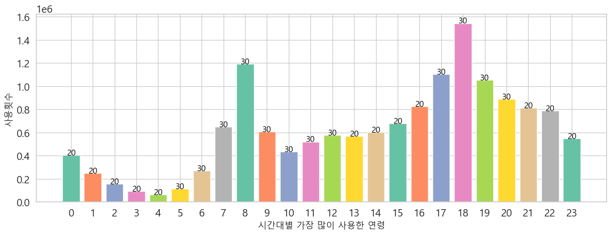
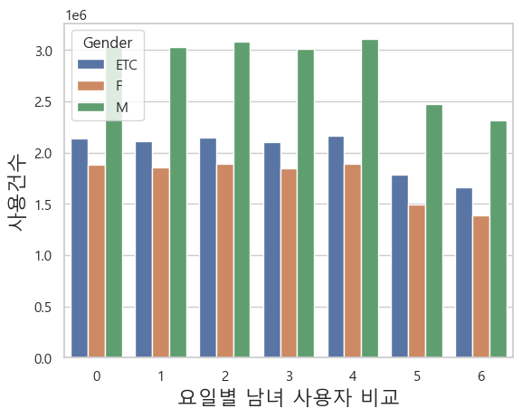

# 공공데이터 기반 자전거 전용도로 확장계획 수립지원시스템

## 1. 목표와 기능

### 1.1 목표

대한민국의 서울 시민으로서, 따릉이를 이용하는 본인을 포함한 팀원은 자전거 전용도로의 부족으로 인해 불편함을 겪고있음. 

1. 번화가 이외의 거주지역 근처 자전거 대여소의 부족
2. 자전거 도로의 부족으로 인해, 자동차 및 시민 사고 위험
3. 과다 과소 대여소로 인한 자전거 배치의 불균형

이러한 문제를 해결하기 위해, 공공 데이터를 활용하여 따릉이 이용 데이터를 분석하고, 이를 바탕으로 자전거 전용도로 확장 계획에 도움이 되는 데이터 분석 시스템을 개발.

본 프로젝트의 핵심 목표는 서울시의 따릉이 이용 데이터와 지역구별 자전거 전용도로 데이터를 통합 분석하여, 서울시 자전거 도로 확장 계획을 효과적으로 지원하는 것. 
이를 위해 Python, Pandas, Numpy와 같은 데이터 분석 도구를 사용하여 서울시에서 제공하는 대규모 이용 데이터를 처리하고 분석했음.

이 분석을 통해 얻은 인사이트가 서울시 따릉이 및 자전거 전용도로 인프라 개선에 기여할 수 있기를 기대.

??? 따릉이외 일반 자전거는 고려안함?

### 1.2 데이터 출처

- 수집 데이터

(친환경)자전거 도로 데이터
서울시 공공자전거 대여 이력 2023
서울시 따릉이대여소 마스터 정보
따릉이 사용 만족도 데이터 ( 성별, 연령별 등 )

- 수집방법

공공데이터 포털 검색
서울 스마트맵

### 1.3 데이터 분석 방법론

이 프로젝트에서는 서울시 자전거 인프라 확장을 지원하기 위해 다양한 분석 기법을 활용하여 따릉이 이용 데이터와 자전거 도로 데이터를 통합적으로 분석함. 
데이터 분석 과정은 다음과 같은 주요 단계를 거쳐 진행됨.

1. **데이터 수집 및 정제**
   - 서울시에서 제공하는 따릉이 대여 이력, 자전거 전용도로 위치 정보, 따릉이 대여소 정보, 사용자 만족도 데이터를 공공데이터 포털과 서울 스마트맵을 통해 수집.
   - 수집된 데이터는 결측값 처리, 이상치 제거 등 전처리 작업을 거쳐 분석에 적합한 형태로 정제.

2. **기초 통계 및 이용 패턴 분석**
   - Pandas와 Numpy를 사용하여 시간대별, 요일별, 계절별 따릉이 이용 빈도에 대한 기초 통계를 분석, 특정 지역의 따릉이 이용 증가나 감소를 파악하여 수요 변화를 예측.
   - 연령대별, 성별 등 인구 통계학적 요소를 고려하여 사용자의 이용 패턴을 분석함으로써 특정 지역에서의 따릉이 수요 특성을 파악.

3. **도로 부족 지역 및 최적 확장 구역 도출**
   - 지역별 자전거 전용도로 위치와 따릉이 이용 데이터를 비교 분석하여 자전거 전용도로가 부족한 지역을 식별.
   - 과다 또는 과소 대여소를 분석하여 자전거 배치의 불균형을 파악하고, 자전거 전용도로 확장이 필요한 구역을 추천.

4. **향후 이용 수요 예측**
   - 과거 이용 데이터를 기반으로 머신러닝 모델을 사용하여 특정 시간과 지역에서의 따릉이 수요를 예측. 시계열 분석을 통해 향후 수요를 예측하고, 자전거 인프라 확장 우선순위를 설정.

5. **시각화 및 인사이트 도출**
   - 분석된 데이터를 효과적으로 시각화하기 위해 Matplotlib과 Seaborn을 활용하여 다양한 그래프를 생성하고, Folium을 사용해 지도 기반 시각화를 통해 자전거 도로 위치와 수요를 시각적으로 표현.
   - 시각화 결과는 웹 기반 대시보드에서 실시간으로 확인할 수 있도록 제공하여, 서울시 자전거 도로 확장 계획에 대한 인사이트를 도출.

6. **결과 보고 및 정책 제안**
   - 분석 결과를 바탕으로 서울시 자전거 인프라 개선을 위한 정책 제안을 작성하며, 
   자전거 도로 확장이 필요한 지역, 자전거 배치 불균형 해소 방안 등을 포함하여 서울시의 자전거 전용도로 확장 계획에 기여할 수 있는 구체적인 방안을 제시.

이와 같은 데이터 분석 방법론을 통해 서울시의 자전거 도로 확장 계획 수립에 실질적인 도움을 줄 수 있는 데이터 기반 인사이트를 제공.

### 1.4 시스템 기능

- 따릉이 이용 패턴 분석

시간대별, 요일별, 계절별 따릉이 이용 빈도를 분석하여 언제, 어디서 따릉이 사용이 많은지 확인.
특정 지역의 따릉이 이용 증가나 감소를 파악하여 수요 변화를 예측.

<!-- - 지역별 이용자 경로 시각화

따릉이 대여와 반납 위치 데이터를 바탕으로, 자주 사용되는 경로와 이동 패턴을 시각화하여 자전거 전용도로 수요가 높은 지역을 파악. -->

- 도로 부족 지역 도출

지역별 자전거 전용도로 위치와 따릉이 이용 데이터를 비교하여, 자전거 전용도로가 부족한 구역이나 추가적으로 확장해야 할 지역을 도출.

- 최적의 자전거 도로 확장 구역 추천

이용 빈도가 높은 지역과 자전거 전용도로가 부족한 지역을 종합하여 서울시 자전거 도로 확장에 최적화된 구역을 추천.

<!-- - 이용자 피드백 및 만족도 분석

이용자 피드백 데이터를 수집하거나 분석하여 자전거 인프라에 대한 만족도를 평가하고, 개선이 필요한 요소를 파악. -->

- 향후 이용 수요 예측

과거 데이터를 기반으로 머신러닝 모델을 활용하여 특정 시점과 지역에서의 따릉이 이용 수요를 예측하고, 자전거 인프라의 우선 확장 지역을 제안.

<!-- - 환경적 영향 분석

자전거 이용 증가로 인한 교통량 감소와 이산화탄소 배출 절감 효과를 추정하여 자전거 인프라 확장의 환경적 이점을 제시. -->

### 1.5 팀 구성 및 역할 분장
<table>
   <tr>
      <th>팀장: 강유화</th>
      <th>팀원1: 박상준</th>
      <th>팀원2: 조하나</th>
      <th>팀원3: 이예은</th>
   </tr>
   <tr>
      <td></td>
      <td></td>
      <td></td>
      <td></td>
   </tr>
</table>

## 2 개발 환경

### 하드웨어 사양

- CPU: Intel Core i7-4770 @ 3.40GHz
- RAM: 16GB
- GPU: 내장 그래픽 (Intel UHD 630)

### 운영체제(OS)

- Windows 10 Home (64비트, 22H2)

### IDE 및 개발도구

- IDE: VSCode
- AI 및 데이터 분석 도구: Google Colab

### 사용 언어

- 데이터분석 및 AI: Python

### Python 라이브러리:

- 데이터 분석 도구

Custom Filtering Library: 분석 전 필요한 데이터 필터링을 위한 커스텀 라이브러리
Pandas: 데이터 조작 및 전처리를 위한 주요 라이브러리
geopy.geocoders: 위도와 경도를 이용해 주소를 가져오는 라이브러리

- 시각화 도구

Matplotlib: 데이터 시각화를 위한 기본 그래프 라이브러리
Seaborn: 통계적 시각화를 강화한 그래프 라이브러리
Folium: 지리적 데이터를 시각화하는 지도 라이브러리

- 데이터 분석 및 머신러닝 모델링 도구

Scikit-learn: 회귀 분석과 네트워크 분석 등 다양한 머신러닝 모델 지원
Statsmodels: 시계열 분석과 통계적 검정을 위한 라이브러리

<!-- ### AI 모델:

- 시계열 분석 모델:

ARIMA (AutoRegressive Integrated Moving Average): 따릉이 이용 시간에 따른 연령대별 이용 현황 예측
Prophet (페이스북 오픈 소스): 계절성과 추세를 반영하여 따릉이 이용 시간 패턴 분석

- 회귀 분석 모델:

선형 회귀: 이용 횟수와 이용 시간 간의 관계 분석을 통해 자전거 전용도로 수요 예측
다중 회귀 분석: 다양한 변수들 간의 상관관계를 고려하여 이용 패턴 파악

- 텍스트 마이닝 모델:

Sentiment Analysis (감성 분석): 따릉이 사용자 리뷰와 만족도를 분석하여 자전거 도로 확장 필요성 평가
Word2Vec: 사용자 리뷰에서 핵심 키워드 추출 및 연관 키워드 분석

- 네트워크 분석 모델:

NetworkX: 구별 이동 패턴을 파악하여 주요 이동 경로와 자전거 전용도로 확장이 필요한 구역 파악 -->

### 형상관리

- Git, GitHub

## 3. 요구사항 명세와 기능 명세

<!-- - 데이터 수집 및 저장

서울시에서 제공하는 따릉이 이용 데이터 및 자전거 전용도로 데이터를 수집하고, 이를 정리하여 데이터베이스에 저장할 수 있어야 함.
지리적 데이터를 처리하기 위한 위도와 경도 데이터를 포함한 데이터베이스 테이블 구축.
따릉이 사용자 피드백 데이터(만족도)를 수집하여 저장할 수 있어야 함. -->

- 데이터 전처리 및 필터링

사용자 정의 필터링 라이브러리를 사용해 데이터의 정제 및 필터링을 수행할 수 있어야 함.
Pandas를 이용해 데이터 프레임으로 전처리 작업을 수행하여, 분석 및 시각화에 적합한 데이터로 준비.

<!-- - 분석 및 모델링 기능

시계열 분석을 통해 연령대별, 시간대별 따릉이 이용 패턴을 분석하고 예측할 수 있어야 함.
회귀 분석을 통해 이용 횟수와 시간의 상관관계를 분석하여 자전거 전용도로 확장 필요성을 평가할 수 있어야 함.
텍스트 마이닝을 활용해 사용자 만족도 데이터를 분석하고, 자전거 전용도로와의 관련성을 파악.
구별 이동 패턴을 분석할 수 있는 네트워크 분석 기능 제공. -->

- 시각화 기능

분석된 데이터를 그래프로 시각화할 수 있어야 함 (Matplotlib, Seaborn).
위도와 경도 기반 데이터를 Folium을 이용해 지도 위에 시각화하여 자전거 도로 위치 및 수요를 시각적으로 보여줄 수 있어야 함.

<!-- - 사용자 인터페이스(UI)

웹 기반 대시보드를 제공하여 분석 결과를 직관적으로 확인할 수 있어야 함.
사용자가 원하는 조건에 따라 데이터를 필터링하고, 시각화 결과를 실시간으로 업데이트 가능해야 함. -->

<!-- - 환경 요구사항

Python 3.8 이상.
데이터 분석에 필요한 라이브러리 설치 (Pandas, Numpy, Matplotlib, Seaborn, Folium, Scikit-learn, Statsmodels)
웹 서버 환경: Django
데이터베이스: MySQL -->

## 4. 데이터 분석 결과

### 4.1 상관관계 분석

공공데이터기반으로 서울시 공공자전거 따릉이의 사용에 대한 상관관계를 분석 해보았을때, 
월기준으로 사용량과 사용거리, 사용횟수와 사용거리의 상관 관계가 나타남. 

많이 사용하는 사람은 대부분 오래 사용하거나 따릉이를 대여한 횟수가 비례관계가 성립하였고, 
23년 1년간 시간대별의 데이터를 이용해서 이용거리와 이동시간간의 관계를 자세히 살펴보았을때 또한 이용시간과 이용거리가 관계가 있는 것을 알 수 있음. 

### 4.2 연령대별 이용 현황

월별 데이터로 분석할때는 ~10대로 분류되어 10대가 이용비율에 들어가는 비율이 높았으나,
23년 초단위 대여이력 공공데이터에는 작성된 태어난 년도에서 오류가 많아 버려지는 데이터가 많았음. 
그래서 둘의 데이터의 오차는 있으나 20대와 30대의 이용율이 높으며 10대 마찬가지로 이용율이 높은것으로 보임.

이용 건수 확인 결과 평일 사용 비율이 가장 높고,
각 평일 이용건수에 비해 주말의 이용 건수가 다소 낮은것으로 확인.

평일과 주말의 시간대별 사용량 분석결과 평일과 주말의 사용 시간대가 다르다는 것을 확인, 특히 평일에는 출퇴근 시간대에 사용량이 증가하지만 주말에는 오후 시간대에만 증가하는 것이 인상적임.  

시간대별 현황을 분석한 결과 총 이용횟수가 가장 많은 시간대는 평일 출퇴근 시간대이며 이 시간대에 주 사용자는 30대임을 알수 있음.
그 외 시간대는 20대 사용 비율이 높음.  

성별에 따른 이용 건수의 차이는 남성이 2배 가까이 우세한 경향을 보임, 하지만 etc로 표시된 결측치가 높아 정확한 판단에는 무리가 있어보임

요일별 분포에서 남녀 모두 주말에 사용건수가 줄어드는 경향성을 보이는 것을 확인 할 수 있음.

23년 시간별 대여이력으로 분석한 사용시간에 따른 남녀 사용 분포를 살펴 본 결과,
첫번째 그림은 생년과 남녀가 데이터가 기록되지 않은 데이터는 드롭하여 사용하였음. 
주 사용자인 20대와 30대를 살펴보자면 20대는 전체 시간대 성비 상관없이 고르게  사용을 분포하고 오후 시간대에 사용량이 비교적 높은 것을 볼 수 있으며,
30대의 경우 출퇴근 시간대의 사용량이 높은 것을 다시 한 번 확인 할 수 있음. 
70~90대의 연령대에선 여성의 사용 비율이 낮은 것을 알 수 있으며, 10대는 하교 시간 이후 사용량이 높은것을 파악할 수 있다. 

평일/주말의 연령대를 분석해 보았을 떄에도 2,30 대의 이용률이 높다는 것을 재차 확인

<!-- ## 4. 프로젝트 구조

### 4.1 프로젝트 구조

### 4.2 개발 일정(WBS)

## 5. 역할 분담

- 팀장 : 강유화
- 박상준
- 조하나
- 이예은

## 6. 와이어프레임 / UI / BM

### 6.1 와이어프레임

### 6.2 화면 설계

## 7. 데이터베이스 구조도(ERD)

## 8. Architecture

## 9. 데이터 분석 결과 및 주요 기능 설명

## 10. 클래스 다이어 그램 -->

## 99. 에러와 에러 해결

## 99. 개발하며 느낀점
